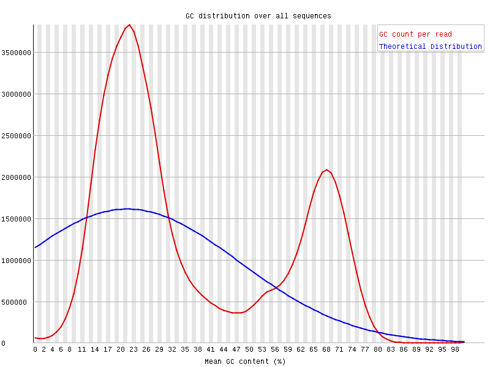

# hse24_hw1

##### Ссылка на ноутбук https://colab.research.google.com/drive/1d7FIlMm8ItYvAN7w2MLNnWZUPGOp-rVL?usp=sharing
Так же положила в папку src код с колаба

Провелиа  анализ  FASTQC  с SRR5836473_1.fastq (отчет лежит в папке data)

Необычное распределение GC может быть связано с бисульфитным секвенированием, так как во время него неметелированный Цитозин переходит в Урацил. C меняется на U.

**Что видно на графике:**

- Реальное распределение (красная кривая): показывает фактическое распределение GC-содержания в ридах.
- Теоретическое распределение (синяя кривая): ожидание на основе случайного распределения оснований в геноме.

Необычное распредление может быть по нескольким причинам:

- При бисульфитном секвенировании неметилированные цитозины (C) конвертируются в урацил (U), который при секвенировании определяется как тимин (T).
- В результате содержание C значительно снижается, а содержание T увеличивается.
- В геномных регионах, где цитозины преимущественно метилированы (например, CpG-островки), C сохраняется, что приводит к появлению второго (или смещённого) пика.
  

 
**Что видно на графике:**

- В стандартном DNA-seq распределение оснований (A, T, G, C) по позициям в риде обычно одинаковое или близкое к ожидаемому.
- В BS-Seq данных наблюдается значительное увеличение линии для T и снижение для C.

Так происходит по нескольким причинам:

- Неметилированные цитозины превращаются в тимин, что приводит к завышенному содержанию T.
- Метилированные цитозины остаются неизменными, поэтому C не исчезают полностью, но их процент существенно ниже ожидаемого.
- Баланс между A и T, а также G и C нарушается вследствие химической обработки.

Полученная таблица:

| Файл | Стадия развития | Чтения на 11347700-11367700 | Чтения на 40185800-40195800 | Процент дупликации |
| - | - | - | - | - |
| SRR5836473 | 8 cell   | 551 | 194 | 81.72 % |
| SRR3824222 | Epiblast | 1344 | 565 | 97.09 % |
| SRR5836475 | ICM      | 797 | 274 | 90.93 % |

### MBIAS PLOT (отчеты лежат в папке data/html)

Стабильное CpG-метилирование (~40–50%) по всей длине обоих ридов говорит об отсутствии сильного позиционного артефакта.
Низкое CHH/CHG-метилирование указывает на эффективную конверсию неметилированных цитозинов и невысокий уровень метилирования в не-CpG-контекстах, что характерно для ранних эмбриональных стадий (8-cell).

8cell – 8-клеточный эмбрион, примерно 2.25 дня после оплодотворения яйцеклетки

Уровень CpG-метилирования ~20% согласуется со стадией ICM, когда в эмбрионе происходит активная деметилирование некоторых регионов генома.
Низкое CHH/CHG-метилирование говорит о том, что неметилированные цитозины вне CpG-контекста успешно конвертировались в тимин при бисульфитной обработке.

ICM – внутренняя клеточная масса бластоциста, примерно 3.5 дня после оплодотворения яйцеклетки

Высокий уровень CpG-метилирования (~80%) согласуется с тем, что к стадии Epiblast геном вновь приобретает значительную часть метильных меток (по сравнению с ранними стадиями).
Низкое CHH/CHG-метилирование указывает на успешную конверсию неметилированных C в не-CpG-контексте.

Epiblast – стадия эпибласта, примерно 6.5 дней после оплодотворения яйцеклетки

### Гистограммы

Полученные диаграммы похожи на референс

На стадии 8-клеточного эмбриона доминирует низкий уровень метилирования, но сохраняются участки с высокой метилированностью (импринты и др.).

 На стадии ICM ещё преобладает низкая метилированность, но уже видны признаки частичного восстановления метилирования по сравнению с 8-cell.

 На стадии Epiblast глобальное метилирование в значительной мере восстановлено, что подтверждается доминированием пика около 100%.

Таким образом:

- 8-cell: после оплодотворения идёт активная и пассивная деметилировка, поэтому большинство цитозинов имеют низкий уровень метилирования.
- ICM: внутренняя клеточная масса бластоцисты сохраняет преобладающую долю неметилированных участков, но часть локусов начинает реметилироваться.
- Epiblast: на ~6.5 день происходит существенное восстановление (реметилирование) генома, что приводит к высокому уровню метилирования в большинстве локусов.

### Уровень метелирования и покрытия

Выводы:
8-cell: после оплодотворения происходит активная/пассивная деметилировка, поэтому в целом уровень метилирования снижен.
ICM: ещё в основном низкий уровень метилирования, но уже могут появляться «островки» реметилирования.
Epiblast: глобальная реметилировка, поэтому наблюдаются более высокие значения метилирования в большинстве регионов.

### Определение DMR  и DMC с помощью metilene

DMC и DMR определены с помощью metilene (файлы в отчете):

Подготовка данных: Объединение данных по позициям из трех образцов в единый входной файл, где каждой группе присваивается свой идентификатор.
Запуск анализа: Использование metilene с параметрами (-t 4 для многопоточности, -f 3 для DMC) позволяет провести парное сравнение между стадиями эмбрионального развития (8-cell, ICM, Epiblast) и выявить регионы и отдельные цитозины с дифференциальным уровнем метилирования.
Обоснование выбора параметров:

-t 4: ускоряет вычисления при наличии достаточного количества ядер.
-f 3: переключает алгоритм для поиска DMC.
Сравнение между группами g1, g2 и g3 отражает биологическую динамику: от глобальной деметилировки на ранних стадиях (8-cell, ICM) до реметилирования в Epiblast.

### Бонус
Всего уникальных генов: 2341 попало в DMR

Cформирован общий список генов, которые встречаются в DMR хотя бы в одном  сравнении:
- [all_genes_union.csv](./data/analyses/all_genes_union.csv)

- **DMR** между 8-cell, ICM и Epiblast затрагивают широкий спектр генов, многие из которых связаны с:
  - Регуляцией транскрипции
  - Органеллами (цитоплазма, ядро)
  - Цитоскелетом (intermediate filament, microtubule и т.д.)
  - Транспортом и локализацией белков

(G0_*.csv в папке analyses)
* В сравнении 8-cell vs ICM (GO_1-2.csv) может наблюдаться обогащение по терминам, связанным с регуляцией транскрипции и ранней плюрипотентностью.
Анализ DMR, полученных при сравнении 8-cell и ICM (dmr_1-2.txt), показал пересечение ~150 генов, среди которых Oct4 (Pou5f1), Sox2, Nanog и другие регуляторы плюрипотентности. GO-анализ (GO_1-2.csv) выявил обогащение по следующим ключевым терминам: “embryonic development”, “stem cell differentiation”, “DNA-binding transcription factor activity” с q-value < 0.05.

В сравнении ICM vs Epiblast (GO_2-3.csv) часто появляется ремоделирование хроматина, организация гистонов, так как эпибласт проходит дальнейшую реметилировку и дифференцировку. Сравнение ICM и Epiblast (dmr_2-3.txt) выявило пересечение ~200 генов: Tet2, Dnmt3a, Klf4 и др. Термины “DNA methylation”, “chromatin organization” и “somatic stem cell population maintenance” оказались наиболее значимыми (FDR < 0.01) согласно GO-анализу (GO_2-3.csv).

В сравнении 8-cell vs Epiblast (GO_1-3.csv) обычно выявляется крупномасштабная эпигенетическая перестройка, в т.ч. термины типа “methylation”, “DNA demethylation”, или пути, связанные с органогенезом.Сравнение 8-cell и Epiblast (dmr_1-3.txt) отражает суммарные изменения метилирования от ранней стадии к более поздней. Около ~250 генов пересеклись с DMR, включая факторы транскрипции семейства Hox, ростовые факторы Fgf. Наиболее обогащённые пути: “embryonic morphogenesis”, “chromatin remodeling” (p < 1e-4) (GO_1-3.csv).

### 2.1 8-cell vs Epiblast

На графике видим, что наиболее обогащённые термы связаны с:
- `cytoplasm`
- `localization`
- `transport`
- и т.д.

### 2.2 ICM vs Epiblast

Среди топ-термов здесь также присутствуют:
- `cytoplasm`
- `intermediate filament`
- `organelle organization`
- и другие.

### 2.3 8-cell vs ICM

Здесь помимо `cytoplasm`, выделяются мотивы с факторами транскрипции `ZF5`, `E2F-1`, `FOXN4` и пр.
